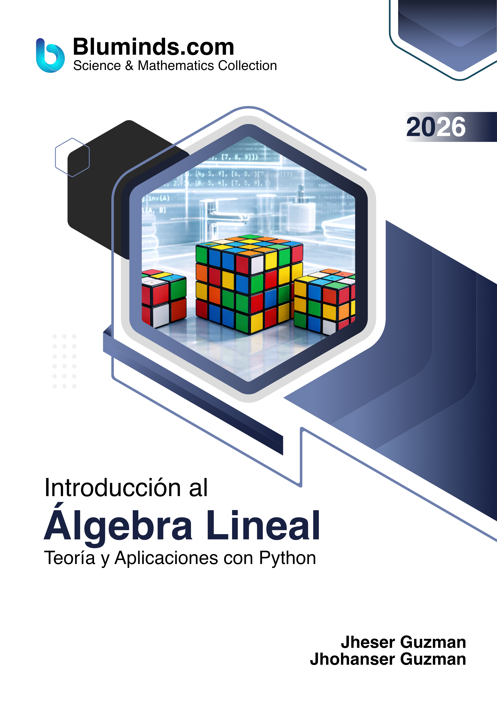
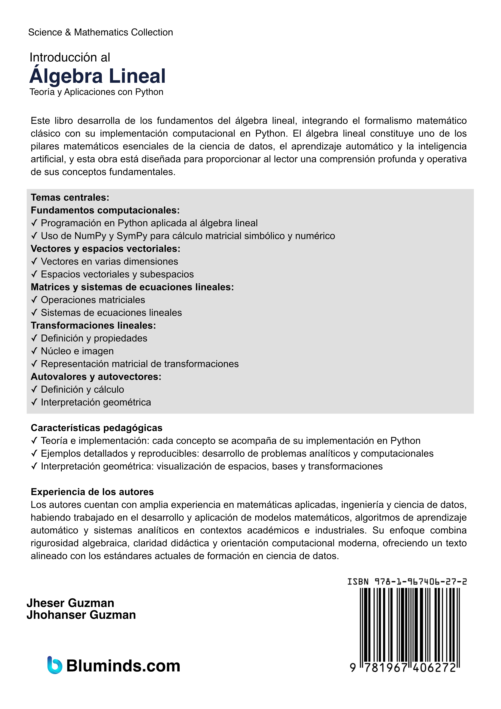
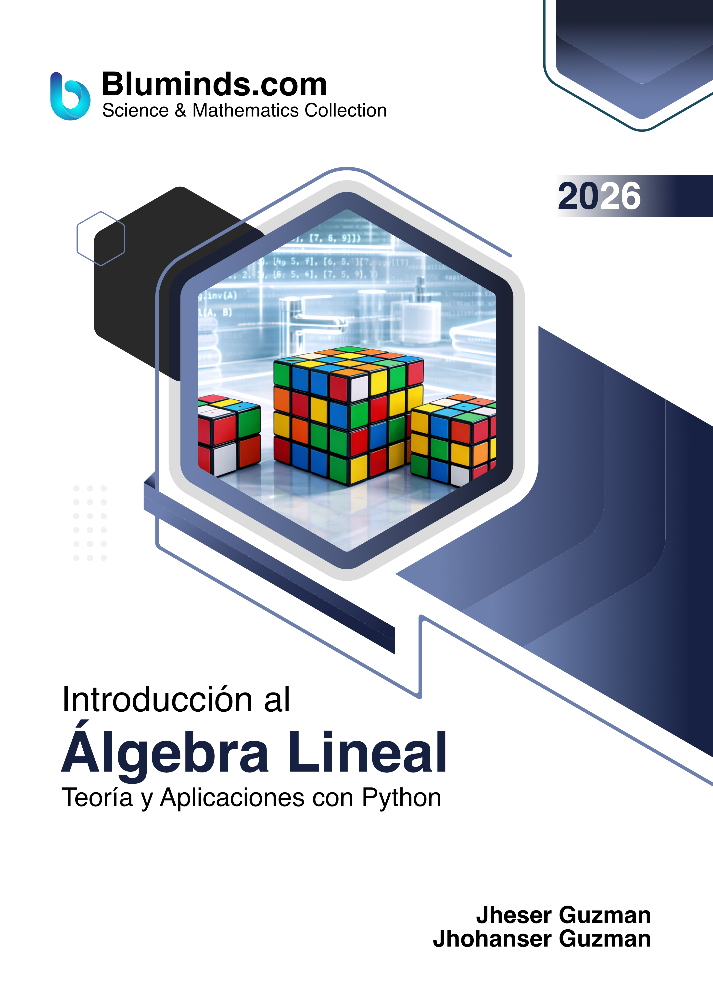
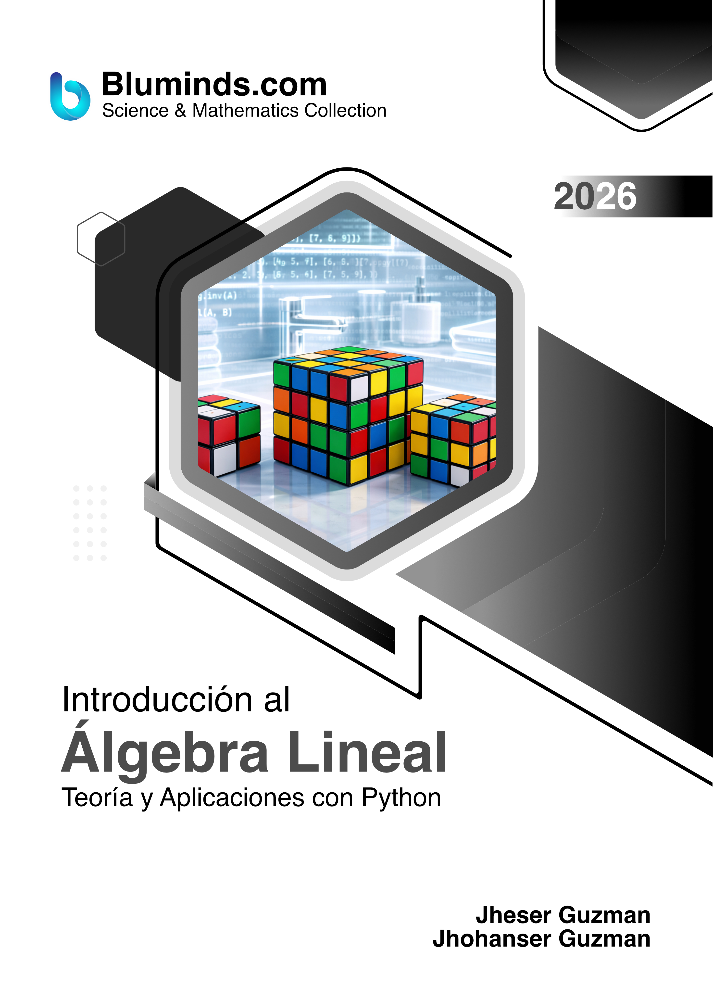

# Introducción al Álgebra Lineal — 1ra Edición

**Autores:** Jheser Guzman, Jhohan Guzman

---

| FRONT COVER | REAR COVER |
|:---:|:---:|
|  |  |

---

## Descripción

Este libro desarrolla los fundamentos del álgebra lineal, integrando el formalismo matemático clásico con su implementación en Python. El álgebra lineal constituye uno de los pilares matemáticos esenciales de la ciencia de datos, el aprendizaje automático y la inteligencia artificial, y esta obra está diseñada para proporcionar al lector una comprensión profunda y operativa de sus conceptos fundamentales.

---

### Temas centrales

**Fundamentos computacionales:**
- **✓ Programación en Python** aplicada al álgebra lineal
- **✓ Uso de NumPy y SymPy** para cálculo matricial simbólico y numérico

**Vectores y espacios vectoriales:**
- **✓ Vectores** en varias dimensiones
- **✓ Espacios vectoriales** y subespacios

**Matrices y sistemas de ecuaciones lineales:**
- **✓ Operaciones matriciales**
- **✓ Sistemas de ecuaciones lineales**

**Transformaciones lineales:**
- **✓ Definición y propiedades**
- **✓ Núcleo e imagen**
- **✓ Representación matricial** de transformaciones

**Autovalores y autovectores:**
- **✓ Definición y cálculo**
- **✓ Interpretación geométrica**

---

### Características pedagógicas

- **✓ Integración teoría–implementación:** cada concepto algebraico se acompaña de su implementación en Python
- **✓ Ejemplos detallados y reproducibles:** desarrollo completo de problemas analíticos y computacionales
- **✓ Interpretación geométrica:** visualización de espacios, bases y transformaciones

---

### Experiencia de los autores

Los autores cuentan con amplia experiencia en matemáticas aplicadas, ingeniería y ciencia de datos, habiendo trabajado en el desarrollo y aplicación de modelos matemáticos, algoritmos de aprendizaje automático y sistemas analíticos en contextos académicos e industriales. Su enfoque combina rigurosidad algebraica, claridad didáctica y orientación computacional moderna, ofreciendo un texto alineado con los estándares actuales de formación en ciencia de datos.

---

## Presentaciones del libro

| Formato | Libro |
|---------|:---------:|
| 📗 **Paperback + Color** |  [🛒 Comprar en Amazon](https://www.amazon.com/dp/1967406278)|
| 📘 **Paperback + Escala de Grises** |  [🛒 Comprar en Amazon](https://www.amazon.com/dp/1967406499) |
| 📙 **Hardcover + Color Premium** | [🛒 Comprar en Amazon](https://www.amazon.com/dp/1967406308) |

---

## Tabla de Contenido

| # | Capítulo | Notebook |
|:-:|----------|:--------:|
| — | Antes de Comenzar | [▶](source_code/before_to_begin.ipynb) |
| 1 | Introducción al Álgebra Lineal | [▶](source_code/chapter_01.ipynb) |
| 2 | Python para Álgebra Lineal | [▶](source_code/chapter_02.ipynb) |
| 3 | Vectores | [▶](source_code/chapter_03.ipynb) |
| 4 | Sistemas de Ecuaciones Lineales | [▶](source_code/chapter_04.ipynb) |
| 5 | Matrices | [▶](source_code/chapter_05.ipynb) |
| 6 | Determinantes | [▶](source_code/chapter_06.ipynb) |
| 7 | Transformaciones Lineales | [▶](source_code/chapter_07.ipynb) |
| 8 | Autovalores y Autovectores | [▶](source_code/chapter_08.ipynb) |
| A | Apéndice A | [▶](source_code/ZZ_appendix_a.ipynb) |

> Cada capítulo incluye también un notebook de **problemas resueltos** (`chapter_XX_solved_problems.ipynb`).

📄 **Muestra gratuita:** [Descargar Capítulo 1 (PDF)](ebook_sample/Introduccion%20al%20Algebra%20Lineal%2C%20Jheser%20Guzman%20y%20Jhohan%20Guzman%2C%202025%2C%20Ebook%20Sample%20%28Chapter%201%29.pdf)

---

## Contacto e Información

- 🌐 **Sitio web:** [www.bluminds.com](https://www.bluminds.com)
- 🐦 **Twitter / X:** [@blumindsllc](https://x.com/blumindsllc)
- 🎬 **YouTube:** [youtube.com/@bluminds](https://www.youtube.com/@bluminds)
- 💻 **Código Fuente:** [github.com/Bluminds/Book-LinAlg-v1-CodeExamples](https://github.com/Bluminds/Book-LinAlg-v1-CodeExamples)
- 💻 **Slides:** Contactar a [info@bluminds.com](mailto:info@bluminds.com) (incluye el recibo de compra del libro).
- 📧 **Contacto:** [info@bluminds.com](mailto:info@bluminds.com)

---

## Fe de Erratas

Si encuentras un error en el libro (tipográfico, matemático o de código), puedes reportarlo abriendo un [Issue en GitHub](https://github.com/Bluminds/Book-LinAlg-v1-CodeExamples/issues) o enviando un correo a [info@bluminds.com](mailto:info@bluminds.com) con el asunto **"Fe de Erratas"**, indicando:
- Número de página
- Párrafo o sección donde se encuentra el error
- Descripción de la corrección propuesta

Las correcciones verificadas se registran en la siguiente tabla:

| Página | Párrafo | Corrección |
|--------|---------|------------|
| | | |
